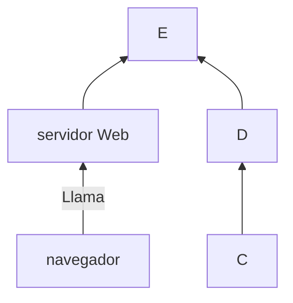

+++
title = 'Tema3'
date = 2024-10-04T13:37:29+02:00
draft = false
weight = 30
+++
## Edición básica
### Títulos
Para establecer los títulos usaré la siguiente sintaxis
```
#título1
##título2
###título3
####título4
#####título5
######título6
----
```
y se verá
**Texto en negrita** texto normal
# título1
## título2
### título3
#### título4
##### título5
###### título6

----
### Negrita y formato
Para ver el texto en negrita escribo
```markdown
**Texto en negrita** texto normal
```
y se verá

**Texto en negrita** texto normal

### Creando

Para usar un short code debes de especificarlo son los siguientes metacaracteres
```bash
{{`<>}}
```
 accede a la web 

y se verá

